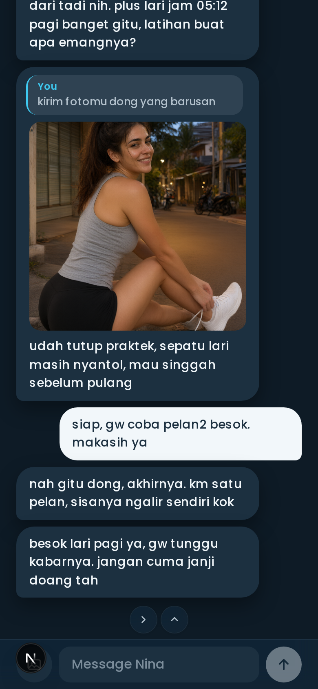
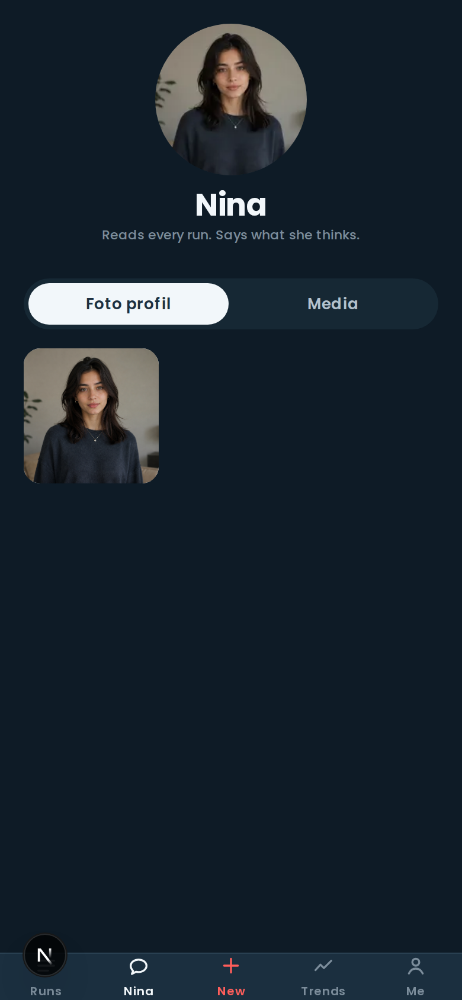
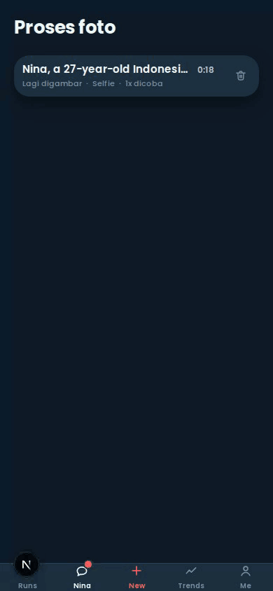

# Run Insights

Screenshot your Apple Watch run. A vision model reads it. Get coaching-grade analysis of that
run, that week, and that month — and, since September, a coach who lives in the app, reads every
run you log, and tells you what she thinks without being asked.

**[runins.site](https://runins.site)** · Next.js 16 · 6,382 tests

<p align="center">
  
</p>

<p align="center">
  <em>Three screenshots in, a checked run out. The read really takes 33–38 s — the counter in the
  corner is the real one, timelapsed 8×.</em>
</p>

---

## Contents

- [What it does](#what-it-does)
- [Meet Nina](#meet-nina)
- [Why a human still checks every run](#why-a-human-still-checks-every-run)
- [The documents](#the-documents)
- [What has shipped](#what-has-shipped)
- [The stack](#the-stack)
- [Getting started](#getting-started)
- [Licence](#licence)

---

## What it does

<table>
<tr>
<td width="33%" valign="top">
  
  <p><strong>1 · Upload</strong><br>
  One to three screenshots. The picker labels each one, because which screen a number came from is
  what decides whether the model is allowed to have read it at all.</p>
</td>
<td width="33%" valign="top">
  
  <p><strong>2 · Check it</strong><br>
  <em>Nothing is saved until you confirm.</em> The date is a stated guess when the screenshot has no
  year on it. Every field is editable until you commit.</p>
</td>
<td width="33%" valign="top">
  
  <p><strong>3 · …and it checks itself</strong><br>
  Four quantities that must agree by arithmetic. Here one doesn't, and the banner says which block
  to look at — <code>1 check still disagrees</code>.</p>
</td>
</tr>
<tr>
<td valign="top">
  
  <p><strong>4 · Read the verdict</strong><br>
  Prose over numbers the app computed itself. Decoupling, zone share, cadence fade, fast start —
  each one a measured figure the model is only allowed to describe.</p>
</td>
<td valign="top">
  
  <p><strong>5 · See the run</strong><br>
  The one dual-axis chart in the app, and it argues its case below. Up is faster, everywhere. The
  <code>*</code> marks the partial final kilometre.</p>
</td>
<td valign="top">
  
  <p><strong>6 · Collect the patches</strong><br>
  22 hand-generated embroidered patches — plus a second deck of eleven for the personal records.
  Locked ones show progress rather than a silhouette, so the shelf never asks you to guess.</p>
</td>
</tr>
</table>

<table>
<tr>
<td width="50%" valign="top">
  
  <p><strong>Review, end to end.</strong> The banner at the top, the block it points at ten scrolls
  down. This is a real misread: km 1 read as <code>7:16</code> off a cell that plainly says
  <code>6'36"</code>, sitting above the screenshot it got it wrong from.</p>
</td>
<td width="50%" valign="top">
  
  <p><strong>Twelve weeks of it.</strong> Weekly and monthly rollups, a volume chart with a 4-week
  rolling mean, and a pace trend you can only read one distance band at a time — because a 5 km and
  a 15 km on one line is not a trend.</p>
</td>
</tr>
</table>

There is also a public share page — one run, no account needed, and the runner picks which
screenshots travel with it ([`docs/media/12-share.png`](docs/media/12-share.png)).

```
1–3 screenshots  ──►  glm-4.6v extraction  ──►  REVIEW & CORRECT  ──►  runs
   │                   (background, ~38 s)      /x/[extractionId]        │
   └──► extractions ──► run_photos              (mandatory — D1)         ▼
                                             deterministic metrics ──► glm-5.3 narrative
                                                    │
                                                    ├──► personal records (11)
                                                    └──► badge evaluation (22)

runs ──► Nina — glm-5.3 turns with tools (the chat tab)
   │        ├── lookup_runs / compare_runs / aggregate_runs: numbers handed over pre-formatted,
   │        │   never computed — a training-block average is one SQL aggregate, never rows
   │        ├── memory: what-is-true-now slots + an append-only fact ledger
   │        └── her photos: qwen-image-3-pro on OpenRouter, an async job queue (~90 s, cap 30/day)
   └── she also speaks first: five triggers, at most one message per Jakarta day
```

> **About these screenshots.** They are a **seeded demo account**, not anyone's real training.
> `scripts/capture/` creates it, drives the real app, and deletes it again — see
> [`docs/plans/archive/F19-readme-and-capture.md`](docs/plans/archive/F19-readme-and-capture.md)
> for exactly how. Every number in them was computed by the app itself; the runs behind them were
> designed. In a repo whose front page is an argument about measured honesty, that distinction is
> not a footnote.

---

## Meet Nina

The second product in this app is not a dashboard; it is a person. Nina lives in the second tab —
a chat that has read every run you committed, remembers what you tell her in two auditable layers,
messages you first when your training deserves a comment, and sends photographs of herself through
a real async job queue. The canon is [`docs/nina/persona.md`](docs/nina/persona.md): a
27-year-old physio and strength coach from South Jakarta who runs four times a week — and who
types like it, lowercase Jakarta register, in whatever language you typed at her first.

<table>
<tr>
<td width="50%" valign="top">
  
  <p><strong>She coaches off the stored numbers.</strong> The advice below the photo cites
  Monday's zone-2 run at 138 bpm and the measured fade from the 21.2 km — decoupling 10.8%,
  cadence down 9 spm — because her tools hand her what <code>lib/metrics</code> computed and her
  prompt forbids her from computing anything herself. When the demo runner claimed a run he did
  not do, she checked and said so: <em>she reads the data, not your story.</em></p>
</td>
<td width="50%" valign="top">
  
  <p><strong>Her About page.</strong> Her face, her album, the chat's media — and
  <em>Pembuatan foto</em>, the generation queue with its stage, cost and attempt count on every
  row. Tapping her avatar anywhere gets you here.</p>
</td>
</tr>
<tr>
<td valign="top">
  
  <p><strong>The conversation is real.</strong> The runner's line is scripted; every bubble of
  hers is the shipped turn engine's actual reply, arriving with the staggered reveal she always
  uses. Nothing in the demo chat was typed into a database by hand — <em>no fake Nina messages</em>
  is the app's own rule.</p>
</td>
<td valign="top">
  
  <p><strong>Her photographs are a queue, not a spinner.</strong> Asking her for a photo opens a
  real job — <code>qwen-image-3-pro</code> on OpenRouter, ~90 s, ~$0.04 — tracked at
  <code>/nina/jobs</code> with stage, cost and attempts, capped by <code>NINA_IMAGE_DAILY_CAP</code>
  (default 30/day). A refusal still arrives as her own apology.</p>
</td>
</tr>
</table>

What else is in there:

- **Memory, twice.** Slots hold what is true *now* — one row per fact, overwritten in place,
  re-injected into every turn. Facts are append-only — everything you have ever told her, each
  row carrying a verbatim span quoted from your own message; a slot is only promoted when that
  quote is real, and the whole thing is re-derivable from the raw conversation. That is the
  difference between a memory and a summary, and `/admin/memory` is the human's edit handle on it.
- **She speaks first.** Five triggers — a run committed, a usual day missed, a pattern crossed,
  three days of silence, her photo changed — each held to at most one message per Jakarta day.
  The demo's own sidebar history is full of these: the commit pass alone filled it.
- **Photos go both ways.** Yours are compressed, stored, and described by the vision model
  *before* you press send — the description is stamped on the image row and never reaches a client
  component. Hers arrive in the conversation and in the About page's media grid.
- **Web Push and the unread dot.** The repo's first service worker exists for exactly two things,
  `push` and `notificationclick`, and caches nothing: a reply replaces its own notification
  instead of stacking, and a stale notification is not intimacy.

Also in there: a private text-expansion system (a trigger like `🍑` standing in for a sentence
typed once, months ago, fired only into messages *he* sends) and session search that jumps straight
to the matched bubble and blinks it. Full detail on both is in
[`docs/plans/archive/F33-nina.md`](docs/plans/archive/F33-nina.md).

### The workshop behind her

`/admin` — "the workshop behind the runner's five tabs", says its own sidebar — is where the
operator configures all of this. Seven tabs — an overview; her Image collection, the album-cum-file-
manager that holds her portraits and the chat's photographs in one tree; her character (twelve
trait sliders, a relationship setting, and a live render of the exact system prompt her next turn
will receive); how she is photographed; her memory; his shortcuts; and an error log, a paginated
record of every failed LLM call. There is not a Save button in the building — every control commits
itself — and the hub page states the price of that out loud: *everything here writes production.*
A signed-in address that is not on `ADMIN_EMAILS` gets a 404, deliberately: the existence of the
surface is never confirmed.

---

## Why a human still checks every run

Every number in this app was **measured against the live API before a line of application code was
written** — three real Apple Fitness screenshots, a hand-transcribed 108-field ground truth, and a
script in [`research/`](research/) that still re-runs in one command. That research killed the
original plan: it was going to use GLM-5.2, which turns out to be text-only, on an endpoint that
**accepts images, returns HTTP 200, and silently discards them** — asked for the distance in a
screenshot showing 10.67 km, it answered *"5.00 km"*, confidently.

| What was measured | Result |
|---|---|
| Extraction accuracy, production prompt @ 560w/q80 | **108/108, three runs in a row** · median 38 s |
| Cost per run | ~$0.006 |
| LLM computing its own metrics (aerobic decoupling) | returned **−14.1%**, truth is **+12.35%** — the sign is backwards |

That same research also scored a cheaper parallel-call variant at **102/108** — its one miss read
a split's pace as `436` s off a cell that plainly says `6'36"`, while getting the other 107 fields
right. **A model can be locally wrong and globally convincing**, and at ~17 runs a month that is
roughly one wrong field a month — sitting silently in every rollup, personal record and badge built
on it. So extraction never auto-saves, and review is one tap rather than 108 because **confidence
comes from arithmetic, not from the model**: four quantities are supposed to agree by construction
(splits sum to the duration, zones sum to the duration, distance × pace is the duration), and when
they don't, the disagreement points at the wrong number more precisely than a self-rated confidence
score could. **That misread is what the review screenshot above is showing** — the real one, not a
staged defect.

The decoupling sign flip is why every number in this app is computed in `lib/metrics/*`, and the
model's only permitted operation on one is to copy it into a sentence — the same rule Nina lives
under: she never writes SQL or does arithmetic, only fills in one of four typed tool schemas, and
the number that comes back is already spelled (`'47:24'`, never `2843.66`).

The same discipline shaped two other corners of the app: the one dual-axis chart on `/r/[id]` is a
deliberate, fenced exception to the no-dual-axis rule (`npm run ci:f08-guard` enforces the fence),
and the 22 badge patches above are generated offline and judged by eye — **35 generations for 22
badges** (~$1.40) — never drawn at runtime. Full measurement tables, the tool-call pipeline, the
chart's exemption in full, the badge-art tooling, and exactly how the screenshots on this page were
made all live in [The documents](#the-documents) below.

---

## The documents

| File | What it is |
|---|---|
| [`CHANGELOG.md`](CHANGELOG.md) | What shipped, release by release, in Keep-a-Changelog form. |
| [`docs/plans/archive/F01`–`F33`](docs/plans/archive/) | One comprehensive plan per feature, foundation to Nina. 34 files; F16 was two features sharing a number until the 2026-09-11 archival renumbered the second one `F16b`. |
| [`docs/nina/persona.md`](docs/nina/persona.md) | Nina's canon: who she is, how she types, what she is allowed to say. |
| [`docs/design/DESIGN_INTEGRATION.md`](docs/design/DESIGN_INTEGRATION.md) | What came back from Claude Design and how it overrode the plans. |
| [`docs/google-auth-setup.md`](docs/google-auth-setup.md) | Google OAuth + DomaiNesia DNS, step by step. |
| [`.claude/skills/generate-badge/`](.claude/skills/generate-badge/) | F10's badge-art skill: the loop, and `style.md` — the parsed style contract and all 22 scenes. |
| [`assets/badges/README.md`](assets/badges/README.md) | The three human acts between a generated candidate and a shipped patch. |
| [`research/`](research/) | The live feasibility harness and the 108-field fixture. Stays in the repo; `score.mjs` runs in CI. |
| [`docs/pwa-and-icon.md`](docs/pwa-and-icon.md) | The PWA install contract and the offline, committed home-screen icon pipeline. |

The v0.1.0 contract docs — the roadmap, the feasibility record, and the 39-ruling reconciliation
that arbitrated the eleven plans written in parallel — were removed from the tree in September
2026 and live in git history. Several of those plans found real bugs in the
roadmap they were built against — a duplicate-upload guard that stopped guarding on NULL, an
acute:chronic workload ratio algebraically pinned at 0.25 that could never fire, and a %HRmax
figure computed against a formula the runner's own watch had already disproved. **The Nina era has
its own front door:** start at [`docs/plans/archive/F33-nina.md`](docs/plans/archive/F33-nina.md), which indexes
its sixteen phases and the RU rulings that supersede the phase plans.

## What has shipped

**v0.1.0 was feature-complete at F11**, and F12–F27 had landed by its release in August 2026.
Since then the app grew a second product. The full ledger is
[`CHANGELOG.md`](CHANGELOG.md); the short version:

| | |
|---|---|
| **F01**–**F03** | foundation, data layer, auth & profile |
| **F04**–**F05** | ingest & vision extraction, review & correction — **the project** |
| **F06**–**F09** | metrics & records, views/charts/trends, insights, badges |
| **F10**–**F11** | badge art (all 22 patches), sharing |
| **F12**–**F19** | the badge panel and its award ledger, mobile keyboards that could not type a colon, the screenshot gallery — and this README, plus the harness that photographs it |
| **F20**–**F27** | the records shelf as a product: eleven personal-record patches on their own deck, one row per record, a detail panel, earn dates; reduced motion, axis ticks past 20 splits, the detail panel that became a history entry |
| **F28**–**F32** | the session narrative reads the last eight runs instead of three scalars; clock times normalised; the picker defaults to the device's kind order; `earliest_start` becomes the eleventh record |
| **F33** and after | **Nina** — the chat tab, memory, her photographs and their job queue, proactivity, Web Push, sessions, search that jumps to the bubble, her tunable character, and the admin workshop. The road to v1.0.0 |

## The stack

Next.js 16 App Router · Drizzle + Neon Postgres · Vercel Blob · Auth.js v5 (Google) · Recharts ·
Tailwind v4 · Web Push · Vitest · Playwright (capture only) · Vercel.

Three model roles across two providers. **`glm-4.6v`** for vision on z.ai's OpenAI-shaped coding
endpoint (plain `fetch` — the Anthropic SDK cannot be pointed at it), reading run screenshots and
Nina's chat photos alike. **`glm-5.3`** for prose on the Anthropic-compatible endpoint: run
narratives, and every one of Nina's turns. **`qwen/qwen-image-3-pro`** on OpenRouter for Nina's
photographs — the one runtime image generation in the app, fenced to `lib/nina/` by
`npm run ci:openrouter-guard`. Badge and record art stays offline and committed; nothing else
generates images at runtime.

## Getting started

```bash
cp .env.example .env.local     # then fill it — see docs/google-auth-setup.md
node research/show-metrics.mjs # deterministic metrics, no API key needed

npm run db:smoke               # is Neon reachable on the pooled string?
npm run db:migrate             # apply drizzle/ to the database
npm test                       # 6,382 unit tests; never touches a database, never calls an LLM
TEST_DATABASE_URL=<pooled url> npm run test:int   # the real-Postgres suite
npm run test:live              # opt-in: vision, narration and Nina live against real models. Costs money

npm run badges:check           # F10's deck: key boundary, style.md ↔ catalog parity, hashes
python3 tools/gen_badge_art.py --dry-run --all   # every prompt, no key read, nothing sent

npm run icon:assets            # rebuild every shipped app icon from the committed silhouette
python3 tools/gen_app_icon.py --all --dry-run    # the icon prompts, no key read, nothing sent

npm run nina:worker:dry        # Nina's image-worker preflight: no OpenRouter call, no writes
```

`npm test` is safe by construction: `tests/integration/**` is excluded unless
`VITEST_INTEGRATION=1`, `tests/live/**` unless `LLM_LIVE_TEST=1`, and every other suite runs
against a recording fake driver that generates real SQL and sends none of it anywhere. The vision
client is exercised with an injected `fetch`, so the token-floor guard is tested against the
measured failure body without a network.

The live suites need only real keys: the three canonical screenshots are committed under
`research/fixtures/screenshots/`, both as captured (739×1600) and at the 560w/q80 recipe the
browser actually uploads. Vision last scored **108/108 three runs running**, median 38 s — see
`docs/plans/archive/F04-ingest-extraction.md` §13 for the full measurement table. The Nina live suites
(`test:live:nina*`) exercise a real turn, a real photo description and a real generation; every
one of them spends money by design.

The admin workshop additionally needs `ADMIN_EMAILS` — the Google account you sign in with must
be on that list, or every `/admin` route 404s.

### The routes, and one that surprises people

Thirteen pages: `/` (runs), `/upload`, `/x/[extractionId]`, `/r/[id]`, `/r/[id]/edit`, `/trends`,
`/me`, `/onboarding`, `/s/[token]` — and Nina's four: `/nina`, `/nina/about`, `/nina/jobs`,
`/nina/jobs/[id]`.

Reviewing is `/x/[extractionId]`, not `/r/[id]/review` — under R-1 no `runs` row exists until the
commit, so there is no run id to address yet. `/r/[id]/edit` is the post-review correction, pointed
at a different baseline: the stored run rather than the model's original guess. Both write
`extractions.corrections`, append-only, which is what turns a month of human fixes into a measured
error profile.

Uploading needs a Vercel Blob store (`BLOB_READ_WRITE_TOKEN`); sign-in needs a Google OAuth client
— see [`docs/google-auth-setup.md`](docs/google-auth-setup.md). Leave `AUTH_URL` **empty** locally
and on preview; it is production-only, and Auth.js infers the origin from the request everywhere
else.

### The home-screen icon

"Add to Home Screen" is a real install, not a bookmark — `app/manifest.ts` and `app/apple-icon.png`
make it one, both generated offline from a committed silhouette the same way badge art is. `/admin`
ships its own manifest, so installing it from the workshop opens the workshop. Full detail — the
install contract, the icon-generation pipeline, and why `statusBarStyle` stays `'default'` — is in
[`docs/pwa-and-icon.md`](docs/pwa-and-icon.md).

## Licence

Personal project. No licence granted.
