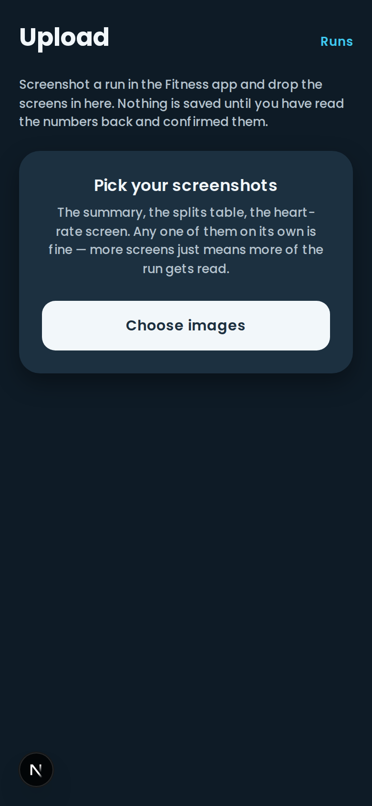
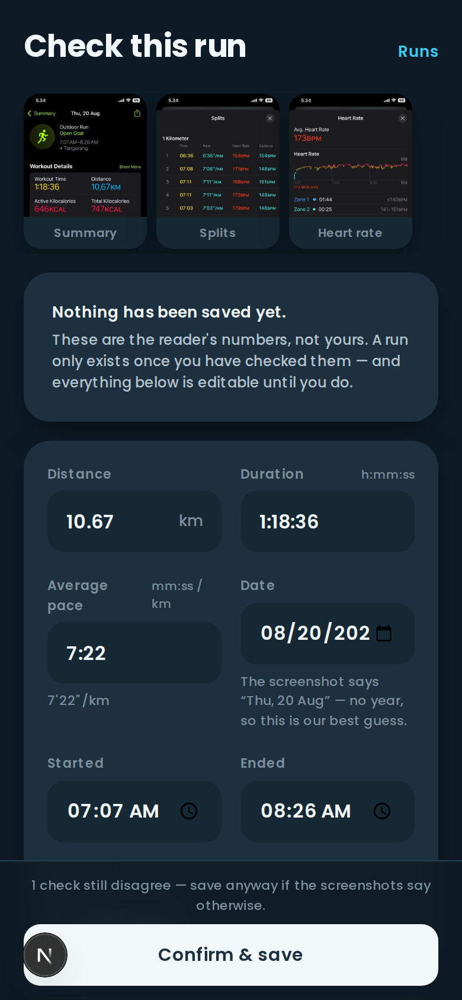
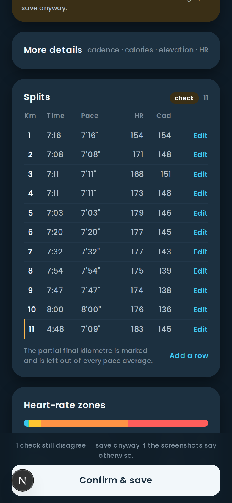
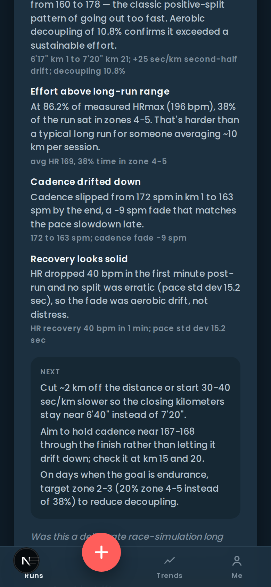
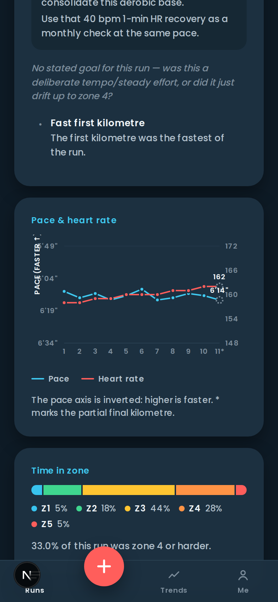
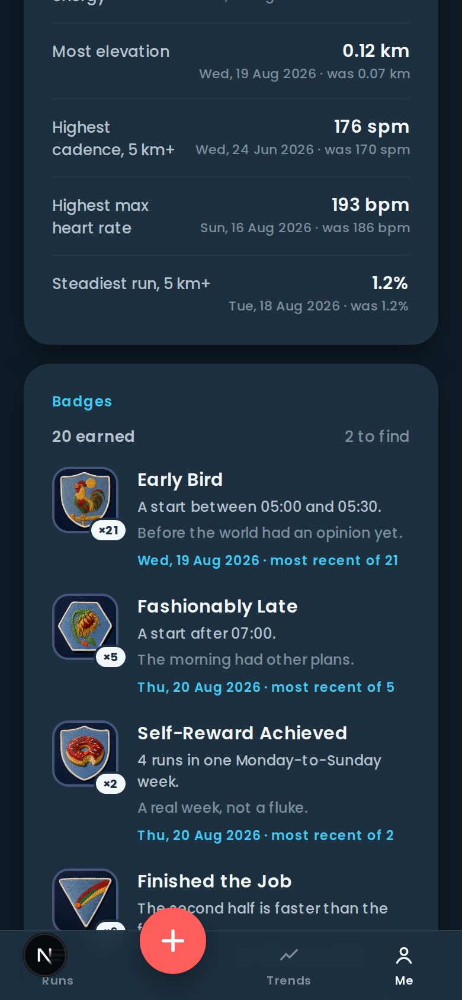
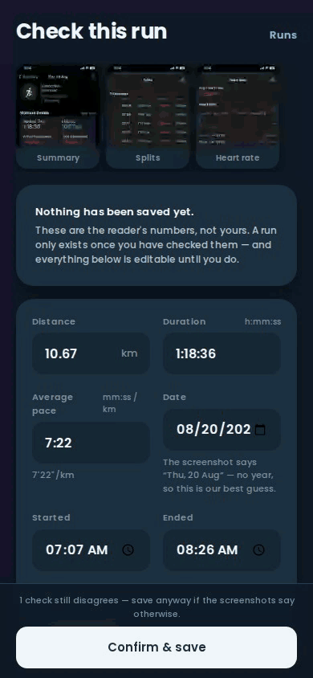
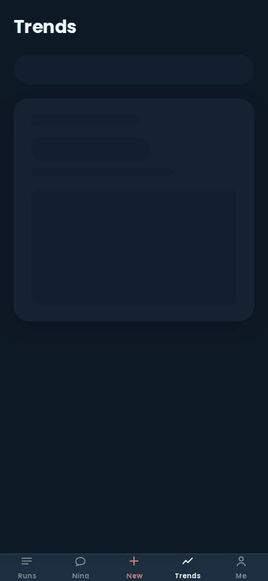

# Run Insights

Screenshot your Apple Watch run. A vision model reads it. Get coaching-grade analysis of that
run, that week, and that month.

**[runins.site](https://runins.site)** · v0.1.0 · Next.js 16 · 1,199 tests

<p align="center">
  
</p>

<p align="center">
  <em>Three screenshots in, a checked run out. The read really takes 33–38 s — the counter in the
  corner is the real one, timelapsed 8×.</em>
</p>

---

## What it does

<table>
<tr>
<td width="33%" valign="top">
  
  <p><strong>1 · Upload</strong><br>
  One to three screenshots. The picker labels each one, because which screen a number came from is
  what decides whether the model is allowed to have read it at all.</p>
</td>
<td width="33%" valign="top">
  
  <p><strong>2 · Check it</strong><br>
  <em>Nothing is saved until you confirm.</em> The date is a stated guess when the screenshot has no
  year on it. Every field is editable until you commit.</p>
</td>
<td width="33%" valign="top">
  
  <p><strong>3 · …and it checks itself</strong><br>
  Four quantities that must agree by arithmetic. Here one doesn't, and the banner says which block
  to look at — <code>1 check still disagree</code>.</p>
</td>
</tr>
<tr>
<td valign="top">
  
  <p><strong>4 · Read the verdict</strong><br>
  Prose over numbers the app computed itself. Decoupling, zone share, cadence fade, fast start —
  each one a measured figure the model is only allowed to describe.</p>
</td>
<td valign="top">
  
  <p><strong>5 · See the run</strong><br>
  The one dual-axis chart in the app, and it argues its case below. Up is faster, everywhere. The
  <code>*</code> marks the partial final kilometre.</p>
</td>
<td valign="top">
  
  <p><strong>6 · Collect the patches</strong><br>
  22 hand-generated embroidered patches. Locked ones show progress rather than a silhouette, so
  the shelf never asks you to guess.</p>
</td>
</tr>
</table>

<table>
<tr>
<td width="50%" valign="top">
  
  <p><strong>Review, end to end.</strong> The banner at the top, the block it points at ten scrolls
  down. This is a real misread: km 1 read as <code>7:16</code> off a cell that plainly says
  <code>6'36"</code>, sitting above the screenshot it got it wrong from.</p>
</td>
<td width="50%" valign="top">
  
  <p><strong>Twelve weeks of it.</strong> Weekly and monthly rollups, a volume chart with a 4-week
  rolling mean, and a pace trend you can only read one distance band at a time — because a 5 km and
  a 15 km on one line is not a trend.</p>
</td>
</tr>
</table>

There is also a public share page — one run, no account needed, and the runner picks which
screenshots travel with it ([`docs/media/12-share.png`](docs/media/12-share.png)).

```
1–3 screenshots  ──►  glm-4.6v extraction  ──►  REVIEW & CORRECT  ──►  runs
   │                   (background, ~38 s)      /x/[extractionId]        │
   └──► extractions ──► run_photos              (mandatory — D1)         ▼
                                             deterministic metrics ──► glm-5.3 narrative
                                                        │
                                                        ├──► personal records
                                                        └──► badge evaluation
```

> **About these screenshots.** They are a **seeded demo account**, not anyone's real training.
> `scripts/capture/` creates it, drives the real app, and deletes it again — see
> [How these screenshots are made](#how-these-screenshots-are-made). Every number in them was
> computed by the app itself; the runs behind them were designed. In a repo whose front page is an
> argument about measured honesty, that distinction is not a footnote.

---

## Why this repo starts with documents

Every number below was **measured against the live API before a line of application code was
written**, using three real Apple Fitness screenshots and a hand-transcribed 108-field ground
truth. The scripts are in [`research/`](research/) and re-run in one command.

That research killed the original plan. It was going to use GLM-5.2, which turns out to be
text-only, on an endpoint that **accepts images, returns HTTP 200, and silently discards them** —
after which the model invents plausible numbers. Asked for the distance in a screenshot showing
10.67 km, it answered *"5.00 km"*, confidently.

| What was measured | Result |
|---|---|
| Extraction accuracy, 3 screenshots → 108 fields | **108/108, five runs in a row** |
| Median latency | 33.7 s |
| Best preprocessing | JPEG q80 @ 560w — 170 KB, 3,277 tokens, no accuracy cost |
| Cost per run | ~$0.006 |
| LLM computing its own metrics | **aerobic decoupling came back −14.1% when the truth is +12.3%** |

Re-measured against the shipped code on 2026-08-21, with the production prompt rather than the
research one:

| What was measured | Result |
|---|---|
| Accuracy, production prompt @ 560w/q80 | **108/108, three runs in a row** · median 38 s · 3,628 tokens |
| The 560w recipe, in actual pixels | 739×1600 → **560×1212**, short edge exactly 560, 55–70 KB |
| A text-only repair round-trip | 25–35 s, ~1,070 completion tokens — about what the primary call costs |

Two calls of that size do not fit Vercel Hobby's 60 s ceiling, so the repair is best-effort and
usually skipped. `lib/extract/constants.ts` says so at the constant.

The decoupling row is the one that shaped the whole architecture: it is why every number in this
app is computed in TypeScript, and the LLM only writes prose about numbers it was handed.

---

## Why 108/108 still means a human checks every run

The same measurement run that scored 108/108 five times also produced the number F05 is built
around: the **parallel-call variant scored 102/108**, and its worst miss was reading a split's
pace as `436` s off a cell that plainly says `6'36"` (396 s) — while getting the other 101 fields
right, including the other ten splits. **A model can be locally wrong and globally convincing.**
Nothing about 107 correct fields signals that the 108th is broken.

At ~17 runs a month that is roughly one wrong field a month, and a wrong split does not fail
loudly: it sits in `runs`, feeds `avg_pace_sec`, feeds every rollup, every personal record and
every badge built on it, until a chart looks odd and nobody can say which of forty runs is at
fault. So extraction never auto-saves (D1), and `runs.reviewed_at` has exactly one writer.

Review would be worthless if it were 108 taps, and the thing that makes it one tap instead is
that **confidence is derived from arithmetic, not from the model**. Four quantities are supposed
to agree by construction — splits sum to the duration, zones sum to the duration, distance × pace
is the duration, and a partial final kilometre's pace matches its own time. When they agree,
nothing is flagged and confirming is a single tap. When they don't, the disagreement points at
the wrong number far more precisely than a self-rated confidence score could, because it comes
from the data rather than from the process that produced the error.

The canonical fixture passes all four, and `tests/review.checks.test.ts` holds them to both
directions: green on the real ground truth, red on the misread that actually happened. **That
misread is what the review screenshot above is showing** — the capture harness injects the real
one rather than inventing a defect, and `tests/capture/dataset.test.ts` pins it to the 40 seconds
it was actually worth.

---

## Every number is computed in TypeScript

`research/control.mjs` handed `glm-5.3` the canonical fixture's raw splits **and the exact
formulas**, and asked it to do six pieces of arithmetic. It got two wrong, and one of them was not
a rounding slip:

| Metric | LLM returned | Truth |
|---|---|---|
| aerobic decoupling % | **−14.1** | **+12.35** |
| % time in Z4+Z5 | 88.3 | 90.60 |

The decoupling sign is **backwards**. Shipped as-is, the narrative would have congratulated this
runner on aerobic fitness that "held up" during the exact run where their heart rate pinned at 90%
of max while their pace faded from 6'36" to 8'00". So `lib/metrics/*` computes every number, and
the model's only permitted operation on one is to copy it into a sentence.

The canonical fixture pins eleven values and fires exactly six flags — `HIGH_DECOUPLING`,
`TOO_MUCH_HARD`, `POSITIVE_SPLIT`, `CADENCE_FADE`, `VERY_HIGH_AVG_HR`, `FAST_START` — no more, no
fewer. Two of those assertions are for values the code must NOT produce: a cadence fade of −9 spm
and a split drift of +35.2 s/km, which are what you get if the final **partial** kilometre is
allowed into a statistic that aggregates split rows (D14). The wrong cadence number is exactly
half the true −18 and looks entirely plausible on a chart, which is why the tests pin constants
rather than signs.

Personal records are recomputed wholesale on every commit, never incremented: a correction that
drops a run below a qualifier has to be able to **remove** a record, and an upsert cannot express
that (R-10).

---

## One chart is allowed to break the rules, and it argues its case

The `dataviz` guidance names dual-axis charts as its top anti-pattern: two scales whose alignment
is arbitrary invent a correlation the data does not contain. Run Insights ships exactly one, on
`/r/[id]`, and the exemption is fenced rather than assumed (F08 §12, upheld by **R-25**):

- pace and heart rate are **two readings of the same kilometre**, not two independently sampled
  series whose x-axis correspondence is a choice;
- both domains are anchored to the run's own min and max plus a **fixed** pad, never a percentage
  one that would widen with the run's variance — a reviewer re-deriving either axis gets this chart;
- the pace axis is **inverted, and says so in words** (`PACE (FASTER ↑)`), because "up is faster"
  everywhere in this app is a global rule, not a per-chart trick;
- the claim it makes is one `lib/metrics/*` already proved arithmetically and the `InsightCard`
  above it states in prose — the chart illustrates a finding, it does not manufacture one;
- every value it plots is also printed in the splits table one scroll below it.

`npm run ci:f08-guard` fails the build if a second `yAxisId` appears anywhere, if `recharts` is
imported outside the six lazily-loaded `components/charts/*Inner.tsx` files (a seventh importer
taxes `/` and `/upload` — screens with no chart at all — with ~100 KB), or if any component
hand-rolls a unit suffix around `lib/format.ts`. The waiver does not generalise, and the check is
what keeps that true.

Everything else follows the ordinary rules, including the ones that are easy to skip: five zone
percentages that sum to exactly 100 by largest-remainder apportionment, a 4-week rolling mean whose
first three points are a **visible gap** rather than a guess, a pace-trend regression withheld until
four weeks exist, a distance-band filter so a 5 km can never be plotted next to a 15 km, and a
table twin under every chart so no number is reachable only by hovering a thumb over a phone.

That last one is also why the charts are screenshot-able at all: `ChartFrame` renders the same
numbers as a real `<table>` beneath every chart.

---

## The badge art is made by hand, one patch at a time, and the tooling enforces that

D12: badge art is generated offline and committed. There is no runtime image generation anywhere
in the app — at ~$0.04 and 4–5 minutes per image, a shelf that drew itself on demand would be a
bill and a latency budget in exchange for nothing a build step can't do better.

So F10 is **machinery first, pictures second**: a skill (`.claude/skills/generate-badge/`), a
style contract, four Python tools and a CI guard — then 22 patches generated one at a time, each
judged by eye before promotion. The deck took **35 generations for 22 badges** (~$1.40), inside
the plan's ~60/$2.40 worst case.

- **`style.md` is an interface, not a document.** `gen_badge_art.py` parses its
  `<!-- STYLE BLOCK vN -->` and `<!-- SCENES -->` fences, and **refuses to start** unless the scene
  keys are exactly `BADGE_CATALOG`'s 22. A badge with no scene, or a scene with no badge, is a
  startup error rather than a surprise 22 images later. `npm run badges:check` asserts the same
  parity from the other side, in CI, where no API key exists.
- **One badge per invocation, never a batch loop.** The three-attempt cap and the look-at-it step
  are per badge; a loop makes both ceremonial, and it would spend the full worst-case budget
  before a human had judged a single patch.
- **Nothing is judged from the 1024² master.** `check_badge_art.py` writes a contact strip of the
  badge at **40 px and 220 px against the app's real `--paper` in both themes**, plus the patch
  edge unrolled (where lettering hides) and the subject at 2× (where anatomy hides). At 1024 every
  stitch looks considered, and the app never draws it at 1024.
- **Same craft, opposite medium.** Every constraint the reference deck earned — no text, full
  bleed, one silhouette, one subject, an anchor image every later badge is generated against —
  survives untouched, because none of them is about ink and paper. Everything that *is* about ink
  and paper was rebuilt: the substrate check inverts (navy is cool, dark, and deliberately
  textured, so its variance gets a **floor** as well as a ceiling), and the ring-geometry fit is
  replaced entirely — this deck's outer shape is a shield, a hexagon, a chevron or a rounded
  triangle by design, and a radial harmonic fit against a chevron is close to meaningless.

Three things the deck taught that the plan could not have known:

- **The anchor is a ruler, not a stencil.** The plan made every badge generate against
  `_anchor.png`, reasoning that twill tone and stitch gauge are continuous quantities a prompt
  specifies loosely. Sound a priori, false for this model: three generations of one badge from an
  identical prompt showed `input_references` transferring the *subject* hard (it redrew the
  anchor's rooster instead of a doughnut, twice) and the *cloth tone* not at all — 9.5 and 9.3
  points of drift with the anchor, **1.9 without it**. What holds the deck together is the style
  block plus one fixed seed.
- **Two instrument fixes, neither a loosened band.** The twill check was sampling a fixed outer
  frame that a 96%-tall patch reaches into — it was measuring the patch and calling it cloth. And
  check 9a was comparing a hexagon's bounding box against a shield's: the first two hexagons
  "drifted" 8.8% and 9.3% while landing 0.4 points apart *from each other*. Both were fixed at the
  instrument, with every already-passing badge unmoved — the signature of a correctness fix rather
  than a capitulation.
- **The contact sheet earned its place on the first run.** `century_club` and `double_century`
  both ended up as "a vertical post with something wound round it" — the exact escalation-pair
  collision the audit predicted, arrived at by a route it did not. Every per-badge check passed
  it; the whole shelf in one line of sight caught it in a second.

Filenames under `public/badges/` carry the first 8 hex of their master's SHA-256, which is the only
reason `next.config.ts` may serve them `immutable` for a year: regenerating a patch changes its
bytes, its hash and its URL, so every cache misses correctly. `npm run badges:check` recomputes
that hash from the master and sweeps for orphans.

---

## How these screenshots are made

Every image above is a build product of a committed input, which is the same rule D12 sets for
badge art and `gen_app_icon.py` sets for the icon. A screenshot taken by hand is a screenshot
nobody can retake — six weeks and one design change later it shows a UI that no longer exists, and
the only way to notice is to compare twelve images against nine routes by eye.

```bash
node --env-file=.env.local scripts/capture/seed-demo.mjs           # a demo account
node --env-file=.env.local scripts/capture/shoot.mjs               # commit, hero, warm, stills, gifs
node --env-file=.env.local scripts/capture/seed-demo.mjs --purge   # and delete it again
```

Four properties are worth knowing, because they are what makes the pictures evidence rather than
decoration:

- **The seed writes no metric.** It writes 25 `extractions` rows and nothing else — no run, no
  split, no record, no badge. `shoot.mjs` then clicks **Confirm & save** on each one, so every run
  is committed by the app's own `commitReviewAction`, and the ten personal records and twenty-two
  badge rules are evaluated by the shipped code. **20 of the 22 badges on that shelf were earned by
  the real rules**; the other two need 200 km in a month and four 4-run weeks, so they stay locked
  and show progress. Nothing in `scripts/capture/` reimplements a rule the app already has.
- **The generated payloads are arithmetically honest.** Each one satisfies all four review checks
  by construction — splits summing to the duration to the second, zones apportioned by largest
  remainder, the partial kilometre's pace derived from its own remainder — which is why confirming
  is one tap. `tests/capture/dataset.test.ts` asserts that against the real `runAllChecks`, and
  runs inside `npm test`, so the fixture cannot drift out of the tolerances silently.
- **The flagged run is the real fixture.** The review screenshots are the committed
  `research/fixtures/golden-response.json` — the genuine `glm-4.6v` reply to the three real
  screenshots — with the genuine misread injected. It is not a staged defect.
- **The hero GIF is a real upload.** Real browser compression to the 560w/q80 recipe, a real Blob
  PUT, a real vision call, a real commit. The counter ticking in its corner is the actual latency.

The encoder is opinionated for measured reasons: `docs/media/` is capped at 8 MB and
`webm-to-gif.mjs` **fails** rather than exceed it, walking down a ladder of frame rates until a GIF
fits and printing which rung it used. Dithering was dropped after a side-by-side showed it
indistinguishable at 64 colours on this flat interface and ~20% larger.

---

## The documents

| File | What it is |
|---|---|
| [`IMPLEMENTATION_PLAN.md`](IMPLEMENTATION_PLAN.md) | The feasibility record. Endpoint matrix, measured accuracy, the token-floor trap. Authoritative on everything it measured. |
| [`ROADMAP_v0.1.0.md`](ROADMAP_v0.1.0.md) | Scope, the 17 locked decisions, and §4 — the authoritative shared contract every feature builds against. |
| [`RECONCILIATION_v0.1.0.md`](RECONCILIATION_v0.1.0.md) | 39 rulings arbitrating eleven plans written in parallel. **Supersedes any individual plan file.** |
| [`docs/plans/F01`–`F19`](docs/plans/) | One comprehensive plan per feature, ~15,700 lines across 21 files. |
| [`docs/design/DESIGN_INTEGRATION.md`](docs/design/DESIGN_INTEGRATION.md) | What came back from Claude Design and how it overrode the plans. |
| [`docs/google-auth-setup.md`](docs/google-auth-setup.md) | Google OAuth + DomaiNesia DNS, step by step. |
| [`.claude/skills/generate-badge/`](.claude/skills/generate-badge/) | F10's badge-art skill: the loop, and `style.md` — the parsed style contract and all 22 scenes. |
| [`assets/badges/README.md`](assets/badges/README.md) | The three human acts between a generated candidate and a shipped patch. |
| [`research/`](research/) | The live feasibility harness and the 108-field fixture. Stays in the repo; `score.mjs` runs in CI. |

**Read `RECONCILIATION_v0.1.0.md` before any plan file.** The eleven plans were written
concurrently and three of them contradicted each other; several also found real bugs in the
roadmap they were built against — a duplicate-upload guard that stopped guarding on NULL, an
acute:chronic workload ratio algebraically pinned at 0.25 that could never fire, and a %HRmax
figure computed against a formula the runner's own watch had already disproved.

## What has shipped

**v0.1.0 was feature-complete at F11**, and eight features have landed since — mostly the kind
found only by using the thing on a phone:

| | |
|---|---|
| **F01**–**F03** | foundation, data layer, auth & profile |
| **F04**–**F05** | ingest & vision extraction, review & correction — **the project** |
| **F06**–**F09** | metrics & records, views/charts/trends, insights, badges |
| **F10**–**F11** | badge art (all 22 patches), sharing |
| **F12**–**F15** | the badge panel and its earn count, the award ledger, mobile keyboards that could not type a colon, the badge master's aspect ratio |
| **F16**–**F18** | splits column gutters, the upload toggle that locked itself, a picker that uploaded everything twice, the screenshot gallery |
| **F19** | this README, and the harness that photographs it |

## The stack

Next.js 16 App Router · Drizzle + Neon Postgres · Vercel Blob · Auth.js v5 (Google) · Recharts ·
Tailwind v4 · Vitest · Playwright (capture only) · Vercel.

Two LLM clients, deliberately: **`glm-4.6v`** for vision on z.ai's OpenAI-shaped coding endpoint
(plain `fetch` — the Anthropic SDK cannot be pointed at it), and **`glm-5.3`** for narrative on
the Anthropic-compatible endpoint. Badge art is generated offline by a skill against
`qwen/qwen-image-3-pro` and committed; nothing generates images at runtime.

## Getting started

```bash
cp .env.example .env.local     # then fill it — see docs/google-auth-setup.md
node research/show-metrics.mjs # deterministic metrics, no API key needed

npm run db:smoke               # is Neon reachable on the pooled string?
npm run db:migrate             # apply drizzle/ to the database
npm test                       # 1,199 unit tests; never touches a database, never calls an LLM
TEST_DATABASE_URL=<pooled url> npm run test:int   # the real-Postgres suite
npm run test:live:vision       # opt-in: calls glm-4.6v for real. Costs money

npm run badges:check           # F10's deck: key boundary, style.md ↔ catalog parity, hashes
python3 tools/gen_badge_art.py --dry-run --all   # every prompt, no key read, nothing sent

npm run icon:assets            # rebuild every shipped app icon from the committed silhouette
python3 tools/gen_app_icon.py --all --dry-run    # the icon prompts, no key read, nothing sent
```

`npm test` is safe by construction: `tests/integration/**` is excluded unless
`VITEST_INTEGRATION=1`, `tests/live/**` unless `LLM_LIVE_TEST=1`, and every other suite runs
against a recording fake driver that generates real SQL and sends none of it anywhere. The vision
client is exercised with an injected `fetch`, so the token-floor guard is tested against the
measured failure body without a network.

The live vision suite needs only a real `LLM_API_KEY`: the three canonical screenshots are
committed under `research/fixtures/screenshots/`, both as captured (739×1600) and at the 560w/q80
recipe the browser actually uploads. It last scored **108/108 three runs running**, median 38 s —
see `docs/plans/F04-ingest-extraction.md` §13 for the full measurement table.

### The routes, and one that surprises people

Nine pages: `/` (runs), `/upload`, `/x/[extractionId]`, `/r/[id]`, `/r/[id]/edit`, `/trends`,
`/me`, `/onboarding`, `/s/[token]`.

Reviewing is `/x/[extractionId]`, not `/r/[id]/review` — under R-1 no `runs` row exists until the
commit, so there is no run id to address yet. `/r/[id]/edit` is the post-review correction, and it
is the same component tree pointed at a different baseline: the stored run rather than the model's
original guess. Both write `extractions.corrections`, append-only, which is what turns a month of
human fixes into a measured error profile (`getExtractionErrorProfile`).

Uploading a run needs a Vercel Blob store linked to the project (`BLOB_READ_WRITE_TOKEN`).
`scripts/f04-e2e-probe.mjs` walks the whole ingest pipeline once against the real Blob store, the
real model and the real database, then deletes what it made:

```bash
node --env-file=.env.local scripts/f04-e2e-probe.mjs path/to/a-screenshot.png
```

Sign-in needs a Google OAuth client — `docs/google-auth-setup.md` has the console walkthrough.
Leave `AUTH_URL` **empty** locally and on preview; it is production-only, and Auth.js infers the
origin from the request everywhere else.

### The home-screen icon

"Add to Home Screen" is a real install, not a bookmark, and the two things that make it one are
`app/manifest.ts` (`display: 'standalone'`) and `app/apple-icon.png` (the `apple-touch-icon` Safari
reads). Both read their names and colours from `lib/pwa.ts`, and `tests/pwa.install.test.ts` asserts
the whole contract — including that each icon file exists, is the size it claims, and carries no
alpha channel, because iOS mattes a transparent icon onto black.

`lib/pwa.ts` is also where to look before switching `statusBarStyle` to `'black-translucent'`: it is
`'default'` on purpose, because almost nothing in this app pads `env(safe-area-inset-top)` yet and
translucent would slide the screen titles under the notch.

The art is two steps, offline and committed, the same rule D12 sets for badge art — no runtime image
calls, no key on the server:

```bash
python3 tools/gen_app_icon.py plain      # candidates → assets/icon/_candidates/ (gitignored)
cp assets/icon/_candidates/plain.aNN.png assets/icon/silhouette.png   # pick one, by looking at it
npm run icon:assets                      # compose + write public/icons/* and app/*-icon.png
```

The split is deliberate: the model draws the runner, and `tools/make_icon_assets.py` draws the
ground, the zone bar, the scale and the centring from `globals.css`'s real tokens. It has to, because
the model returned `#2dc1f9` for a `#23beeb` ground, desaturated the zone colours, and twice ignored
an instruction to keep the bar clear of the bottom edge — where Android's circular crop would have
eaten it.

## Licence

Personal project. No licence granted.
